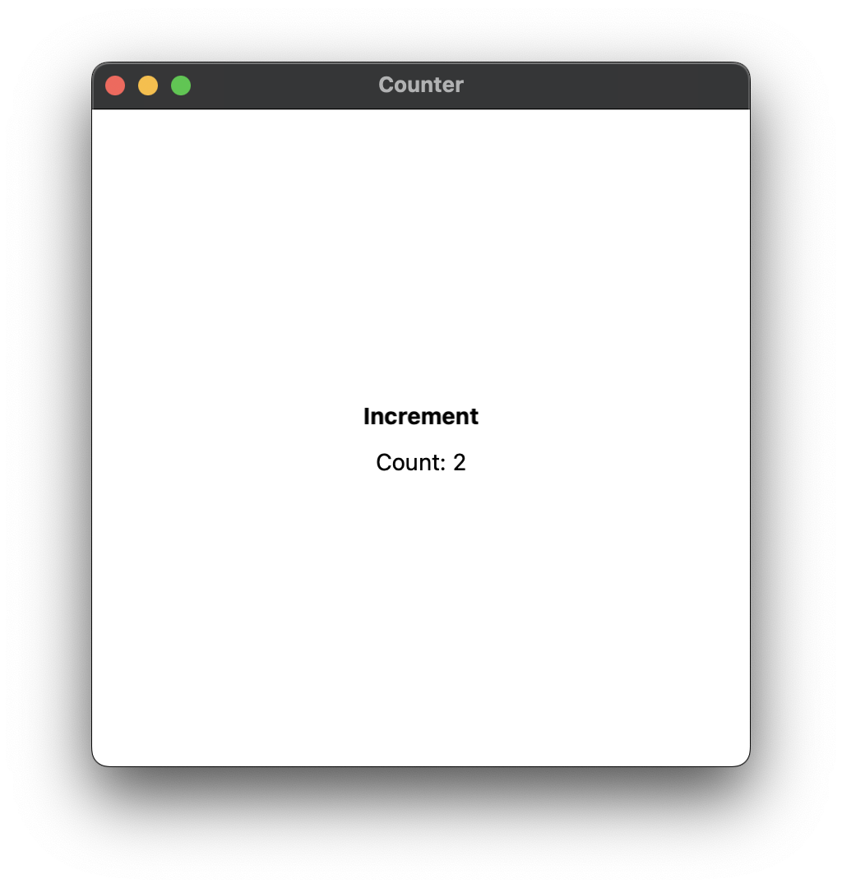

# Quarve

**Quarve is in pre-alpha. Use at your own risk**


Quarve is an experimental rust UI library for desktop applications.
It was made to develop [Monocurl](https://www.monocurl.com),
a mathematical animation app, but can be used more generally.

Learn how to use Quarve from the official [Quarve Book](https://www.monocurl.com/quarve_book).
## Example

Button and counter example.
```rust
fn counter(s: MSlock) -> impl IVP {
    // state
    let count = Store::new(0);
    let count_binding = count.binding();
    let count_label = count.map(|c| format!("Count: {:?}", c), s);

    // views
    let button = button("Increment", move |s| {
        count_binding.apply(NumericAction::Incr(1), s);
    });
    let display = Text::from_signal(count_label);

    vstack()
        .push(button.bold())
        .push(display)
        .text_color(BLACK)
        .frame(F.intrinsic(400, 400).align(Center).unlimited_stretch())
        .background(WHITE)
}
```
Preview


You can run any of the examples in this repository
by using the command `quarve run -n <example_name>` where 
`<example_name>` can be any of 
`conditional, flex, multithread, scroll, textview`

## Installation
After installing cargo, run
```shell
cargo install quarve_cli
```
You can then create a Quarve project with the command
```quarve new <name>```. 
Run the project either by running it as a normal rust binary
or by using ```quarve run```.

## Design Principles
We designed Quarve to satisfy the core principles:

1. **Multithreaded** Quarve extends Rust's fearless concurrency to
   multithreaded app development.
2. **Declarative** We aim to make the syntax of Quarve convenient to read,
   without overly relying on macros. Quarve also follows the pattern of
   composability, allowing for reusable and easy-to-understand code.
3. **Rust-first** As opposed to being a port of a UI library designed for
   another language, Quarve is built around the features
   that define Rust: monomorphism, thread safety, composition, speed, and more.
4. **Native** Quarve views are native-backed, avoiding web browsers and gpu renderers.
   This allows for small installation size and memory footprint.
5. **Fast** We do not use virtual doms and aim for minimal overheard
   compared to a fully native application
   (there is still some work to do).

Currently, Quarve is implemented for macOS, Windows and Linux.
There are many features that are yet to be added,
but the basics are implemented.

Documentation is available at [docs.rs](https://docs.rs/quarve/0.1.0/quarve/).

For further learning, we recommend looking through
the [Monocurl](https://github.com/monocurl/monocurl) source code 
as it is the most complex application using Quarve.
Otherwise, feel free to ask for help in the [Discord server](https://discord.gg/7g94JR3SAD).

